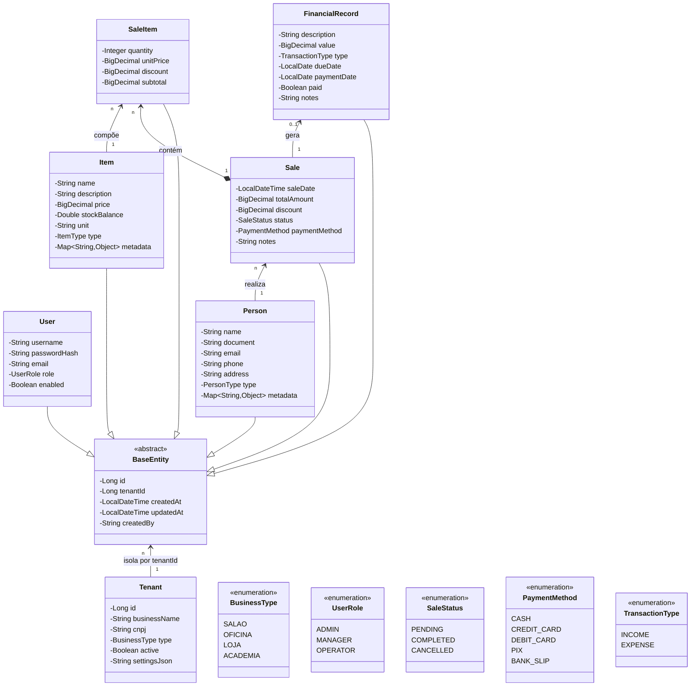

# SGPE — Sistema de Gestão para Pequenas Empresas


Ecossistema SaaS de gestão comercial inteligente projetado para dar ao pequeno e médio lojista o mesmo poder analítico das grandes redes de varejo — com a simplicidade que o dia a dia exige.

---

## O Problema

Pequenos empresários gerenciam estoque em planilhas, fecham o caixa manualmente e só percebem que um produto acabou quando o cliente pede. Faltam dados, sobra trabalho operacional.

O SGPE resolve isso automatizando o operacional e entregando inteligência sobre o negócio em tempo real.

---

## O que o sistema entrega

### Gestão multi-tenant

Uma única plataforma hospeda múltiplos tipos de estabelecimento com isolamento total de dados por `tenantId`. Não há instalação — o lojista acessa sua conta e o ambiente já está configurado para o seu segmento.

| Segmento suportado | Exemplos de uso |
|--------------------|-----------------|
| Salão de beleza | Agendamento, produtos de revenda, faturamento por serviço |
| Oficina mecânica | Peças em estoque, ordens de serviço, fornecedores |
| Loja de varejo | Catálogo de produtos, fluxo de caixa, comportamento de compra |
| Academia | Planos, controle de inadimplência, receitas recorrentes |

### Operação sem fricção

- **Vendas rápidas**: registro de venda em poucos cliques, com atualização imediata de estoque
- **Estoque inteligente**: alertas automáticos de baixo estoque e bloqueio de venda quando o saldo zera
- **Financeiro automatizado**: cada venda gera um lançamento financeiro automaticamente — sem fechar caixa manual no fim do dia

### Inteligência analítica (diferencial Python)

O microserviço de análise aprende com o histórico do negócio e gera insights acionáveis:

- *"Seu estoque de óleo de motor vai acabar em 4 dias"*
- *"Clientes que cortam cabelo com você costumam comprar este shampoo"*
- Projeção de fluxo de caixa com base em sazonalidade histórica

---

## Arquitetura

```
┌─────────────────┐      ┌──────────────────┐      ┌─────────────────┐
│   Frontend      │────▶ │  Backend (Java)  │────▶ │   PostgreSQL    │
│   React + TS    │      │  Spring Boot     │      │                 │
└─────────────────┘      └──────────────────┘      └─────────────────┘
                                  │
                          Eventos via Kafka
                                  │
                                  ▼
                         ┌──────────────────┐
                         │  Microserviço    │
                         │  Análise (Python)│
                         └──────────────────┘
```

**Decisões de design:**

- **Event-driven**: a análise de dados ocorre de forma assíncrona via Kafka, sem impactar a latência das vendas
- **Cache com Redis/Caffeine**: consultas frequentes (catálogo, estoque) são servidas em memória
- **Auditoria completa**: todas as entidades registram `createdBy`, `createdAt` e `updatedAt`
- **Criptografia de dados sensíveis**: senhas e informações críticas nunca são armazenadas em texto puro

---

## Stack tecnológica

| Camada | Tecnologia |
|--------|-----------|
| Backend | Java 17+, Spring Boot, Spring Data JPA, Spring Security |
| Banco de dados | PostgreSQL 16 |
| Cache | Redis + Caffeine |
| Mensageria | Apache Kafka |
| Análise / ML | Python 3.10+, Pandas, NumPy, Scikit-learn |
| Frontend | React, TypeScript, Tailwind CSS / Material-UI |
| Infraestrutura | Docker, Docker Compose, AWS / Azure |

---

## Modelo de domínio



---

## Como executar

**Pré-requisitos:** Docker, Docker Compose, Java 21+ e Python 3.10+

```bash
# Clonar o repositório
git clone https://github.com/vitinh0z/sgpe.git
cd sgpe

# Subir toda a infraestrutura
docker-compose up -d
```

| Serviço | Endereço |
|---------|---------|
| Frontend | http://localhost:3000 |
| Backend API | http://localhost:8080 |

---

## Equipe

| Nome | Papel |
|------|-------|
| Ana Caroline | — |
| Luiz Clemente | — |
| Herbert Rezende | — |
| Victor Gabriel | — |
| Daniel | — |

Dúvidas ou sugestões? Abra uma [issue](https://github.com/vitinh0z/sgpe/issues).

---

## Licença

Distribuído sob a licença MIT. Consulte o arquivo [LICENSE](LICENSE) para mais detalhes.