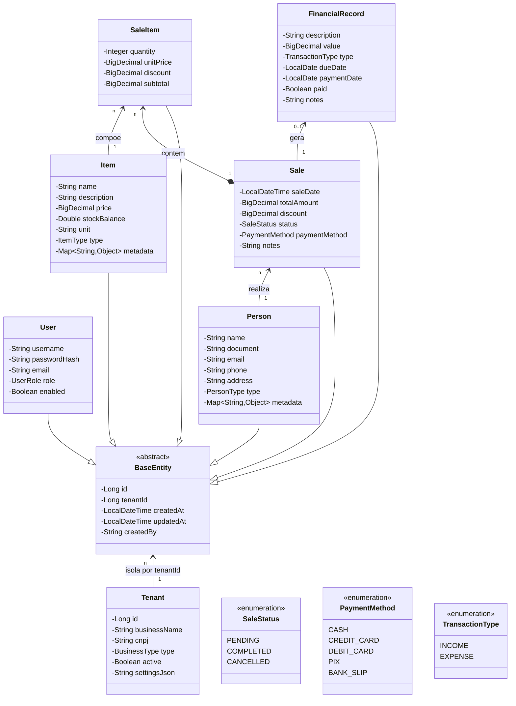

# SGPE — Sistema de Gestão para Pequenas Empresas


Plataforma SaaS multi-tenant de gestão comercial para pequenos e médios estabelecimentos. O objetivo é dar ao lojista o mesmo nível de controle analítico das grandes redes de varejo, com uma interface simples o suficiente para o uso diário sem treinamento.

---

## Sumário

- [O Problema](#o-problema)
- [Segmentos Suportados](#segmentos-suportados)
- [Funcionalidades](#funcionalidades)
- [Arquitetura](#arquitetura)
- [Estrutura do Projeto](#estrutura-do-projeto)
- [Stack Tecnológica](#stack-tecnológica)
- [Modelo de Domínio](#modelo-de-domínio)
- [Pré-requisitos](#pré-requisitos)
- [Configuração do Ambiente](#configuração-do-ambiente)
- [Como Executar](#como-executar)
- [Endpoints e Documentação da API](#endpoints-e-documentação-da-api)
- [Equipe](#equipe)
- [Licença](#licença)

---

## O Problema

Pequenos empresários gerenciam estoque em planilhas, fecham o caixa manualmente e só percebem que um produto acabou quando o cliente pede. Faltam dados, sobra trabalho operacional.

O SGPE resolve isso automatizando o operacional e entregando inteligência sobre o negócio em tempo real: projeção de estoque, comportamento de compra dos clientes e fluxo de caixa com base em histórico.

---

## Segmentos Suportados

| Segmento | Exemplos de uso |
|---|---|
| Salão de beleza | Agendamento, produtos de revenda, faturamento por serviço |
| Oficina mecânica | Peças em estoque, ordens de serviço, fornecedores |
| Loja de varejo | Catálogo de produtos, fluxo de caixa, comportamento de compra |
| Academia | Planos, controle de inadimplência, receitas recorrentes |

---

## Funcionalidades

**Gestão multi-tenant**
Uma única plataforma hospeda múltiplos estabelecimentos com isolamento total de dados. Não há instalação local — o lojista acessa a conta e o ambiente já está configurado para o seu segmento.

**Vendas e estoque**
Registro de venda em poucos cliques com atualização imediata de estoque. Alertas automáticos de baixo estoque e bloqueio de venda quando o saldo zera.

**Financeiro automatizado**
Cada venda concluída gera um lançamento financeiro automaticamente. Painel de inadimplência com vencimentos em atraso e projeção de caixa por período.

**Inteligência analítica**
Microserviço Python consome eventos de venda em tempo real e gera insights acionáveis:
- Previsão de ruptura de estoque com base no ritmo de saída
- Sugestão de produtos complementares por perfil de cliente
- Projeção de fluxo de caixa com base em sazonalidade histórica

---

## Arquitetura

```
+------------------+     +-------------------+     +-----------------+
|   Frontend       |---->|  Backend (Java)   |---->|   PostgreSQL    |
|   React + TS     |     |  Spring Boot      |     |                 |
+------------------+     +-------------------+     +-----------------+
                                  |
                          Eventos via Kafka
                                  |
                                  v
                         +-------------------+
                         |  Microservico     |
                         |  Analise (Python) |
                         +-------------------+
```

**Decisões de design**

- **Arquitetura hexagonal no backend**: o domínio de negócio não depende de frameworks. Services conhecem apenas ports (interfaces); os adapters JPA e HTTP ficam nas camadas externas. Isso facilita testes unitários e permite trocar a implementação de persistência sem alterar regras de negócio.

- **Event-driven com Kafka**: a análise de dados ocorre de forma assíncrona sem impactar a latência das vendas. O padrão Outbox garante que nenhum evento seja perdido mesmo em caso de falha do broker.

- **Cache em dois níveis**: Caffeine (in-process, sub-milissegundo) para leituras locais; Redis (distribuído) para compartilhar estado entre múltiplas instâncias da aplicação. Catálogo de itens e configurações de tenant são os principais candidatos.

- **Isolamento por tenant**: o `tenantId` é extraído do JWT em cada requisição e propagado via `TenantContext` (ThreadLocal). Nenhum endpoint expõe `tenantId` como parâmetro manipulável pelo cliente.

- **Auditoria completa**: todas as entidades registram `createdBy`, `createdAt` e `updatedAt` automaticamente via Spring Data JPA Auditing.

---

## Estrutura do Projeto

```
sgpe/
├── backend/
│   └── src/main/java/com/sgpe/
│       ├── domain/
│       │   ├── model/          # entidades de domínio puras (sem anotacoes JPA)
│       │   ├── enums/          # BusinessType, UserRole, SaleStatus, etc.
│       │   └── port/
│       │       ├── in/         # use cases (interfaces de entrada)
│       │       └── out/        # repository ports (interfaces de saida)
│       ├── application/
│       │   ├── service/        # implementacao dos use cases
│       │   └── dto/
│       │       ├── request/    # records de entrada com Bean Validation
│       │       └── response/   # records de saida
│       └── adapter/
│           ├── in/web/
│           │   └── controller/ # controllers REST
│           └── out/persistence/
│               ├── entity/     # entidades JPA
│               ├── mapper/     # MapStruct: dominio <-> JPA, dominio <-> DTO
│               └── repository/ # JPA repositories + adapters
├── analytics/                  # microservico Python
├── frontend/                   # React + TypeScript
├── docker-compose.yml
├── docker-compose.override.yml # ferramentas de desenvolvimento
└── .env.example
```

---

## Stack Tecnológica

| Camada | Tecnologia |
|---|---|
| Backend | Java 21, Spring Boot 3, Spring Security, Spring Data JPA |
| Banco de dados | PostgreSQL 16 |
| Migrations | Flyway |
| Cache | Redis 7 + Caffeine |
| Mensageria | Apache Kafka |
| Analise / ML | Python 3.10+, Pandas, NumPy, Scikit-learn |
| Frontend | React, TypeScript, Tailwind CSS |
| Documentacao API | SpringDoc OpenAPI (Swagger UI) |
| Resiliencia | Resilience4j (Circuit Breaker, Retry, Rate Limiter) |
| Infraestrutura | Docker, Docker Compose |

---

## Modelo de Domínio



---

## Pré-requisitos

Certifique-se de ter instalado na sua máquina antes de continuar:

| Ferramenta | Versão mínima | Verificar com |
|---|---|---|
| Docker | 24.0 | `docker --version` |
| Docker Compose | 2.20 | `docker compose version` |
| Java (JDK) | 21 | `java --version` |
| Python | 3.10 | `python --version` |
| Node.js | 20 | `node --version` |

---

## Configuração do Ambiente

**1. Clone o repositório**

```bash
git clone https://github.com/vitinh0z/sgpe.git
cd sgpe
```

**2. Configure as variáveis de ambiente**

Copie o arquivo de exemplo e preencha os valores:

```bash
cp .env.example .env
```

Variáveis obrigatórias para subir o projeto localmente:

```dotenv
# Banco de dados
DB_URL=jdbc:postgresql://postgres:5432/sgpe
DB_USER=sgpe
DB_PASSWORD=sgpe_local

# Redis
REDIS_HOST=redis
REDIS_PASSWORD=

# JWT
JWT_SECRET=troque-este-valor-em-producao
JWT_EXPIRATION=86400

# Kafka
KAFKA_BOOTSTRAP_SERVERS=kafka:9092
```

O arquivo `.env` esta no `.gitignore` e nunca deve ser versionado.

---

## Como Executar

**Subir toda a infraestrutura**

```bash
docker compose up -d
```

Aguarde todos os containers ficarem healthy antes de acessar a aplicação. Você pode acompanhar com:

```bash
docker compose ps
```

**Verificar se o backend esta pronto**

```bash
curl http://localhost:8080/actuator/health/readiness
# esperado: {"status":"UP"}
```

**Enderecos dos servicos**

| Servico | Endereco |
|---|---|
| Frontend | http://localhost:3000 |
| Backend API | http://localhost:8080 |
| Swagger UI | http://localhost:8080/swagger-ui.html |
| Kafka UI | http://localhost:8090 |
| pgAdmin | http://localhost:5050 |
| Redis Commander | http://localhost:8081 |

As ferramentas de desenvolvimento (Kafka UI, pgAdmin, Redis Commander) sobem automaticamente via `docker-compose.override.yml` quando o ambiente não é produção.

**Rodar o backend sem Docker (desenvolvimento)**

```bash
cd backend
./mvnw spring-boot:run -Dspring-boot.run.profiles=dev
```

Nesse caso o PostgreSQL, Redis e Kafka ainda precisam estar rodando via Docker:

```bash
docker compose up -d postgres redis kafka zookeeper
```

**Rodar o frontend sem Docker**

```bash
cd frontend
npm install
npm run dev
```

---

## Endpoints e Documentação da API

Com a aplicação rodando, acesse o Swagger UI em:

```
http://localhost:8080/swagger-ui.html
```

Todos os endpoints exigem autenticação JWT, exceto `POST /auth/login`. Para obter um token:

```bash
curl -X POST http://localhost:8080/auth/login \
  -H "Content-Type: application/json" \
  -d '{"username": "admin", "password": "senha"}'
```

Use o token retornado no header das demais requisições:

```
Authorization: Bearer <token>
```

**Recursos disponíveis**

| Recurso | Base path |
|---|---|
| Autenticacao | `/auth` |
| Tenants | `/api/v1/tenants` |
| Usuarios | `/api/v1/users` |
| Pessoas (clientes e fornecedores) | `/api/v1/persons` |
| Itens (produtos e servicos) | `/api/v1/items` |
| Vendas | `/api/v1/sales` |
| Financeiro | `/api/v1/financial` |

---

## Equipe

| Nome | Papel |
|---|---|
| Ana Caroline | — |
| Luiz Clemente | — |
| Herbert Rezende | — |
| Victor Gabriel | — |
| Daniel | — |

Dúvidas ou sugestões? Abra uma [issue](https://github.com/vitinh0z/sgpe/issues).

---

## Licença

Distribuído sob a licença MIT. Consulte o arquivo [LICENSE](LICENSE) para mais detalhes.
